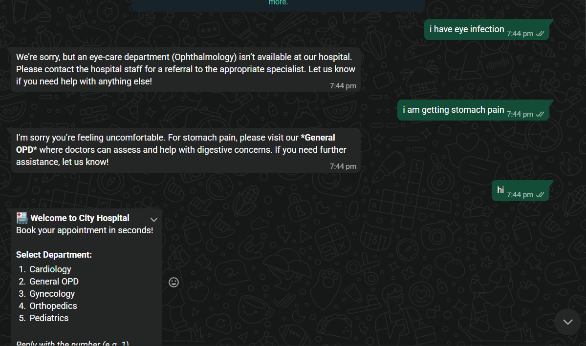
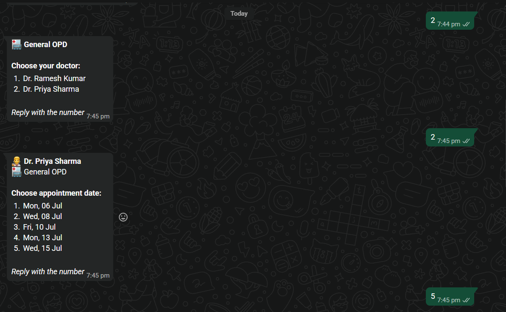
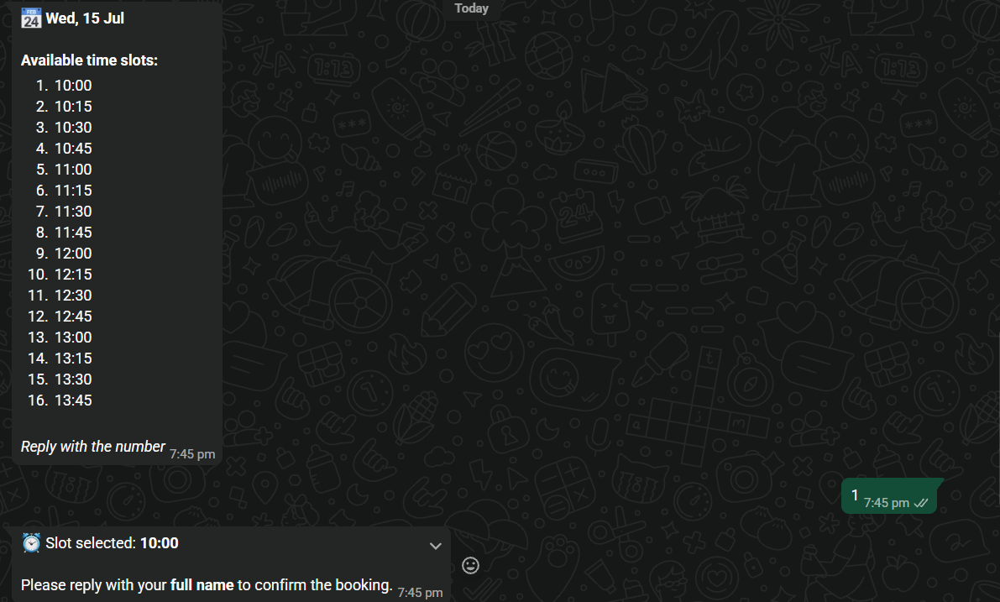

[README.md](https://github.com/user-attachments/files/29652931/README.md)
# ClinicFlow AI

## Overview
ClinicFlow AI is a secure, automated WhatsApp appointment booking system designed for hospitals and clinics. It integrates a deterministic, rule-based booking state machine with an intelligent AI fallback assistant to handle patient queries, ensuring a seamless and reliable patient experience without compromising critical hospital operations.

## Problem Statement
Hospitals and clinics often face high call volumes for routine appointment scheduling, leading to overwhelmed receptionists, long wait times for patients, and administrative bottlenecks. Existing automated solutions are often either too rigid (frustrating patients) or too loosely constrained (leading to AI hallucinations in critical medical contexts).

## Solution
ClinicFlow AI solves this by deploying a 24/7 WhatsApp chatbot that combines the reliability of a deterministic state machine for core booking operations with the flexibility of Groq-powered AI for general queries. It automates scheduling, cancellations, and status tracking while guaranteeing that the AI remains strictly within its defined operational bounds.

## Key Features
- **WhatsApp Appointment Booking**: Patients can book, view, and cancel appointments directly via WhatsApp.
- **Rule-Based Booking State Machine**: Ensures the booking process is strict, guided, and error-free.
- **Groq AI Fallback Assistant**: Intelligently handles unrecognized inputs and general inquiries.
- **Emergency Symptom Detection**: Intercepts critical keywords before AI processing to provide immediate emergency helpline information.
- **Admin Dashboard**: A centralized web interface for hospital staff to manage doctors, patients, and appointments.
- **Automated Daily Reminders**: Sends scheduled appointment reminders via WhatsApp using APScheduler.

## System Workflow
1. **Patient interaction**: The patient sends a message to the hospital's Twilio WhatsApp number.
2. **Webhook processing**: Twilio forwards the message to the Flask webhook.
3. **Emergency check**: The system scans for critical medical keywords. If detected, an immediate emergency response is returned.
4. **State Machine processing**: If the patient is in an active booking flow, the rule-based system handles the input.
5. **AI Fallback**: If the input is not understood and the patient is not in a strict flow, the Groq AI assistant provides a helpful, context-aware response grounded in available hospital departments.

## Screenshots

### 1. AI Symptom Assistant


### 2. Emergency Detection


### 3. WhatsApp Appointment Booking Flow


### 4. Admin Dashboard

## Tech Stack
- **Backend Framework**: Python, Flask
- **Messaging Integration**: Twilio API
- **AI Integration**: Groq API
- **Database**: SQLite
- **Task Scheduling**: APScheduler
- **Frontend (Dashboard)**: HTML, CSS (Vanilla)

## Architecture Explanation
The system follows a linear, decoupled architecture ensuring stability:

```text
Patient
  |
  v
WhatsApp (Twilio)
  |
  v
Flask Webhook
  |
  v
Rule-Based State Machine
  |
  v
If unknown query: Groq AI Fallback
  |
  v
SQLite Database
  |
  v
Admin Dashboard
```

## AI Safety & Constraints
To ensure absolute reliability in a healthcare context, ClinicFlow AI implements strict architectural boundaries:
- **AI never books appointments directly**: The booking process is fully controlled by the deterministic state machine.
- **AI cannot modify the database**: The AI service operates strictly in read-only mode for context generation and cannot execute writes or state changes.
- **Emergency keywords bypass AI**: Life-threatening keywords immediately trigger a hardcoded emergency response, preventing the AI from dispensing potentially harmful medical advice.
- **Booking logic remains deterministic**: The core hospital operations are never subjected to the unpredictability of language models.

## Installation and Setup

### 1. Clone & Setup
```bash
git clone <repository-url>
cd ClincFlow-AI-V2.0/bot
python -m venv venv

# Mac/Linux:
source venv/bin/activate

# Windows:
venv\Scripts\activate

pip install -r requirements.txt
```

### 2. Environment Variables
Copy the `.env.example` file and configure your credentials:
```bash
cp .env.example .env
```
Update the `.env` file with the following variables:
- `TWILIO_ACCOUNT_SID`: Your Twilio Account SID.
- `TWILIO_AUTH_TOKEN`: Your Twilio Auth Token.
- `TWILIO_WHATSAPP_FROM`: Your Twilio sandbox number (e.g., `whatsapp:+14155238886`).
- `ADMIN_PHONE`: Your personal WhatsApp number for reports.
- `GROQ_API_KEY`: Your Groq API key for the fallback assistant.
- `DATABASE_PATH`: `hospital.db`
- `FLASK_ENV`: `production` or `development`

### 3. Run the Server
```bash
python app.py
```

### 4. Expose Local Server
Use ngrok to expose your local server for Twilio webhook integration:
```bash
ngrok http 5000
```
Update your Twilio WhatsApp Sandbox Webhook URL with the provided ngrok HTTPS URL (append `/whatsapp-webhook`).

## Future Improvements
- **Multilingual Support**: Implement Hindi and Telugu localizations to improve accessibility for diverse patient demographics.
- **Expanded Integrations**: Connect with broader Hospital Information Systems (HIS) and Electronic Health Records (EHR).
- **Advanced Analytics**: Enhance the admin dashboard with deeper predictive insights regarding patient flow and peak appointment times.
